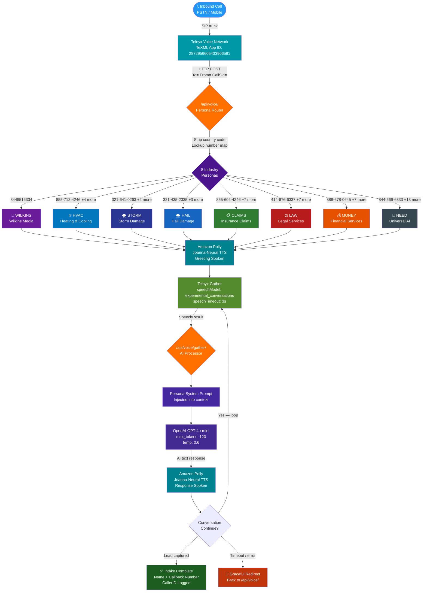

<div align="center">

# 🤖 NEED AI — Intelligent Phone Answering Platform

[](https://needai.unykorn.org)
[](https://nextjs.org)
[](https://www.typescriptlang.org)
[](https://telnyx.com)
[](https://openai.com)
[](https://vercel.com)

**51 vanity numbers · 8 AI personas · GPT-4o-mini · Amazon Polly Neural TTS · Zero-latency response**

*An enterprise-grade AI phone answering system with persona-driven voice agents, real-time speech recognition, and intelligent lead intake across multiple industry verticals.*

</div>

---

## 📋 Table of Contents

| # | Section | Description |
|---|---------|-------------|
| 1 | [System Overview](#-system-overview) | Architecture summary and live URLs |
| 2 | [Architecture Diagram](#-architecture-diagram) | Full call flow from PSTN to AI response |
| 3 | [Persona System](#-persona-system) | 8 industry verticals with color coding |
| 4 | [Number Inventory](#-number-inventory) | All 51 Telnyx numbers mapped to personas |
| 5 | [API Reference](#-api-reference) | Endpoint documentation |
| 6 | [Infrastructure](#-infrastructure) | Vercel, Telnyx, OpenAI stack details |
| 7 | [Environment Setup](#-environment-setup) | Required keys and configuration |
| 8 | [Local Development](#-local-development) | Running the project locally |
| 9 | [Deployment](#-deployment) | Vercel production deploy workflow |
| 10 | [Security](#-security) | API key management and webhook security |

---

## 🔭 System Overview

NEED AI is a **production-grade AI phone answering platform** that routes inbound calls to purpose-built AI persona agents. Each agent is trained on a specific industry vertical (storm damage, HVAC, legal, financial, media) and conducts natural, voice-based lead intake conversations using:

- **Amazon Polly Joanna-Neural** — human-quality TTS, zero synthesis latency
- **OpenAI GPT-4o-mini** — real-time conversational AI (120-token capped responses)
- **Telnyx TeXML** — programmable voice with speech recognition
- **Vercel Edge Runtime** — globally distributed, sub-50ms cold starts

```
CALLER ──► PSTN ──► Telnyx Voice Network ──► TeXML App
                                                    │
                                         needai.unykorn.org/api/voice/
                                                    │
                              ┌─────────────────────┘
                              │   Persona Router (number → vertical)
                              │
                    ┌─────────▼──────────┐
                    │  Amazon Polly TTS  │  ◄── Greeting spoken
                    │  (Joanna-Neural)   │
                    └─────────┬──────────┘
                              │  Gather speech input
                    ┌─────────▼──────────┐
                    │  OpenAI GPT-4o-mini│  ◄── Conversation AI
                    │  (persona system   │
                    │   prompt injected) │
                    └─────────┬──────────┘
                              │  TeXML response loop
                    ┌─────────▼──────────┐
                    │  Lead Captured ✅  │
                    └────────────────────┘
```

**Live Endpoints:**
| Service | URL | Status |
|---------|-----|--------|
| Voice Entry | `POST https://needai.unykorn.org/api/voice/` | 🟢 Live |
| Speech Gather | `POST https://needai.unykorn.org/api/voice/gather/` | 🟢 Live |
| Health Check | `GET https://needai.unykorn.org/api/health` | 🟢 Live |
| Dashboard | `https://needai.unykorn.org/dashboard` | 🟢 Live |

---

## 🗺 Architecture Diagram



---

## 🎭 Persona System

Each inbound number is mapped to an **industry-specific AI persona** with a tailored greeting and GPT-4o-mini system prompt. The persona engine routes based on the `To` parameter from Telnyx, strips the country code, and performs an O(1) hash lookup.

| Color | Persona | Vertical | Voice Character | Objective |
|-------|---------|----------|----------------|-----------|
| 🟣 `#6A1B9A` | **WILKINS** | Media / Advertising | Professional, warm | Connect callers to right Wilkins Media rep |
| 🔵 `#0277BD` | **HVAC** | Heating & Cooling | Friendly, solution-focused | Emergency triage + lead capture |
| 🌑 `#283593` | **STORM** | Storm Damage | Urgent, empathetic | Property damage assessment + intake |
| 🔷 `#1565C0` | **HAIL** | Hail Damage | Empathetic, efficient | Insurance pairing + callback |
| 🟢 `#2E7D32` | **CLAIMS** | Insurance Claims | Calm, professional | Policy number + claim type intake |
| 🔴 `#B71C1C` | **LAW** | Legal Services | Serious, reassuring | Legal matter classification + callback |
| 🟠 `#E65100` | **MONEY** | Financial Services | Trustworthy, confident | Financial need + callback |
| ⬛ `#37474F` | **NEED** | Universal AI | Warm, adaptive | Multi-vertical triage |

### System Prompt Architecture

Every persona follows the same constraint contract injected into GPT-4o-mini:
- ✅ Natural phone-speech responses only
- ✅ Max 3 sentences per response
- ✅ Collect: **name + callback number** (+ vertical-specific fields)
- ❌ No asterisks, bullets, formatting, or URLs
- ❌ No responses over 120 tokens

---

## 📞 Number Inventory

**51 Telnyx numbers** across 8 industry verticals:

### 🌪️ Storm Damage (STORM) — 3 numbers
| Number | Formatted |
|--------|-----------|
| 3216410263 | (321) 641-0263 |
| 3216410878 | (321) 641-0878 |
| 3215033343 | (321) 503-3343 |

### 🌨️ Hail Damage (HAIL) — 4 numbers
| Number | Formatted |
|--------|-----------|
| 3214352335 | (321) 435-2335 |
| 3214858237 | (321) 485-8237 |
| 3215590559 | (321) 559-0559 |
| 3214858333 | (321) 485-8333 |

### ❄️ HVAC Emergency (HVAC) — 5 numbers
| Number | Formatted |
|--------|-----------|
| 8557124246 | (855) 712-4246 |
| 7866778676 | (786) 677-8676 |
| 7273878676 | (727) 387-8676 |
| 6237778676 | (623) 777-8676 |
| 4702878676 | (470) 287-8676 |

### 📋 Insurance Claims (CLAIMS) — 8 numbers
| Number | Formatted |
|--------|-----------|
| 8556024246 | (855) 602-4246 |
| 8886115384 | (888) 611-5384 |
| 8775709775 | (877) 570-9775 |
| 8887120268 | (888) 712-0268 |
| 8886812729 | (888) 681-2729 |
| 8557062533 | (855) 706-2533 |
| 8557712886 | (855) 771-2886 |
| 8886754245 | (888) 675-4245 |

### ⚖️ Legal Services (LAW) — 8 numbers
| Number | Formatted |
|--------|-----------|
| 4146766337 | (414) 676-6337 |
| 2623974245 | (262) 397-4245 |
| 4434378657 | (443) 437-8657 |
| 2134237865 | (213) 423-7865 |
| 8665062265 | (866) 506-2265 |
| 8886532529 | (888) 653-2529 |
| 8889740529 | (888) 974-0529 |
| 8886762825 | (888) 676-2825 |

### 💰 Financial Services (MONEY) — 8 numbers
| Number | Formatted |
|--------|-----------|
| 8886780645 | (888) 678-0645 |
| 8883442825 | (888) 344-2825 |
| 8884748738 | (888) 474-8738 |
| 8885052924 | (888) 505-2924 |
| 8447252460 | (844) 725-2460 |
| 8334452924 | (833) 445-2924 |
| 8886430529 | (888) 643-0529 |
| 8886490529 | (888) 649-0529 |

### 🎯 Wilkins Media (WILKINS) — 1 number
| Number | Formatted |
|--------|-----------|
| 8448516334 | **(844) 851-6334** |

### 🤖 Universal AI (NEED) — 14 numbers
| Number | Formatted |
|--------|-----------|
| 8446696333 | (844) 669-6333 |
| 8337604328 | (833) 760-4328 |
| 8336024822 | (833) 602-4822 |
| 8335222653 | (833) 522-2653 |
| 7702300635 | (770) 230-0635 |
| 9094887663 | (909) 488-7663 |
| 4782424246 | (478) 242-4246 |
| 8887631529 | (888) 763-1529 |
| 8888550209 | (888) 855-0209 |
| 5394767663 | (539) 476-7663 |
| 8447561580 | (844) 756-1580 |
| 9129106333 | (912) 910-6333 |
| 8449854245 | (844) 985-4245 |
| 8449674245 | (844) 967-4245 |

---

## 🔌 API Reference

### `POST /api/voice/`
**Telnyx TeXML entry point — called on every inbound call.**

| Parameter | Type | Source | Description |
|-----------|------|--------|-------------|
| `To` | `string` | Telnyx | Dialed number (E.164 format) |
| `From` | `string` | Telnyx | Caller's number |
| `CallSid` | `string` | Telnyx | Unique call identifier |

**Response:** `text/xml` — TeXML document with persona greeting + `<Gather>` for speech input.

---

### `POST /api/voice/gather/`
**AI processor — called by Telnyx after speech is recognized.**

| Parameter | Type | Source | Description |
|-----------|------|--------|-------------|
| `SpeechResult` | `string` | Telnyx | Transcribed caller speech |
| `To` | `string` | Telnyx | Dialed number (for persona re-resolution) |
| `From` | `string` | Telnyx | Caller's number |
| `Confidence` | `string` | Telnyx | ASR confidence score 0–1 |

**Processing pipeline:**
1. Extract `To` → resolve persona
2. Build GPT-4o-mini messages array with persona system prompt
3. Call `api.openai.com/v1/chat/completions`
4. Return `<Say>` + `<Gather>` loop TeXML

**Response:** `text/xml` — AI response spoken + next gather loop.

---

### `GET /api/health`
Returns `200 OK` with system health status.

---

## 🏗 Infrastructure

```
┌─────────────────────────────────────────────────────────┐
│                    PRODUCTION STACK                       │
├─────────────────┬───────────────────────────────────────┤
│  Layer          │  Technology                            │
├─────────────────┼───────────────────────────────────────┤
│  DNS            │  Cloudflare (unykorn.org zone)         │
│                 │  A record: 76.76.21.21 (Vercel)        │
│                 │  Proxy: OFF (gray cloud)                │
├─────────────────┼───────────────────────────────────────┤
│  CDN / Hosting  │  Vercel Edge Network                   │
│                 │  Project: needai (kevans-projects-…)   │
│                 │  Region: Global edge                    │
├─────────────────┼───────────────────────────────────────┤
│  Framework      │  Next.js 16.1.6 (App Router)           │
│                 │  TypeScript 5.x                         │
│                 │  force-dynamic (no caching)             │
├─────────────────┼───────────────────────────────────────┤
│  Voice          │  Telnyx TeXML                          │
│                 │  App ID: 2872956605433906581            │
│                 │  voice_url: needai.unykorn.org/api/     │
│                 │                          voice/         │
│                 │  TTS: Amazon Polly Joanna-Neural        │
│                 │  ASR: experimental_conversations        │
├─────────────────┼───────────────────────────────────────┤
│  AI             │  OpenAI GPT-4o-mini                    │
│                 │  max_tokens: 120 / temp: 0.6            │
│                 │  8 persona system prompts               │
├─────────────────┼───────────────────────────────────────┤
│  Phone Numbers  │  Telnyx — 51 DID numbers               │
│                 │  8 industry verticals                   │
└─────────────────┴───────────────────────────────────────┘
```

### Key Design Decisions

| Decision | Rationale |
|----------|-----------|
| **Trailing slash on all TeXML URLs** | Telnyx POSTs to gather URLs — without trailing slash, Next.js returns 308 redirect which Telnyx will not follow for POST requests |
| **`force-dynamic` on all routes** | Prevents Vercel from caching voice/AI responses at edge |
| **`legacy-peer-deps=true` in `.npmrc`** | Resolves hardhat-toolbox vs hardhat-ethers peer dependency conflict during `npm install` |
| **Amazon Polly Joanna-Neural** | Zero TTS synthesis latency (streamed), highest quality neural voice available on Telnyx |
| **120 token cap on GPT-4o-mini** | Forces concise 1-3 sentence spoken responses appropriate for telephone |
| **O(1) number lookup** | `personaMap` hash table — constant time persona resolution regardless of number pool size |

---

## ⚙️ Environment Setup

Copy `.env.example` to `.env` and populate:

```env
# ─── OpenAI ──────────────────────────────────────────────
OPENAI_API_KEY=sk-proj-...

# ─── Telnyx Voice ────────────────────────────────────────
TELNYX_API_KEY=KEY019D77B...
TELNYX_PUBLIC_KEY=...

# ─── Application ─────────────────────────────────────────
NEXT_PUBLIC_APP_URL=https://needai.unykorn.org

# ─── Weather (optional — weather-triggered activation) ───
OPENWEATHER_API_KEY=...
```

**Vercel environment variables** are managed via the Vercel dashboard or REST API. Never use PowerShell `echo` pipe to set keys — it injects a trailing newline.

---

## 💻 Local Development

```bash
# Install dependencies (legacy-peer-deps required for hardhat)
npm install

# Start development server
npm run dev
# → http://localhost:3000

# Expose locally via ngrok for Telnyx webhook testing
npm run start:ngrok

# Run end-to-end Telnyx test
npm run test:e2e

# Check all number configurations
npm run numbers:check

# Check Telnyx number status
npm run check-telnyx
```

---

## 🚀 Deployment

```bash
# Ensure git author matches Vercel account
git config user.email "kevanbtc@gmail.com"
git config user.name "kevanbtc"

# Add and commit changes
git add -A
git commit -m "feat: describe your change"

# Deploy to Vercel production
npx vercel "C:\Users\Kevan\needai" --prod --yes
```

**Custom domain setup:**
- A record: `needai.unykorn.org → 76.76.21.21`
- Cloudflare proxy: **OFF** (gray cloud — required for Vercel SSL handshake)
- Telnyx `voice_url`: `https://needai.unykorn.org/api/voice/` ← trailing slash required

---

## 🔐 Security

| Item | Implementation |
|------|---------------|
| **API Keys** | Stored as Vercel environment variables — never in source |
| **`.env` gitignored** | Local secrets never committed |
| **Webhook origin** | All production calls originate from Telnyx IP ranges |
| **No auth on voice endpoints** | By design — Telnyx webhooks cannot send auth headers in TeXML flow |
| **Token budget** | GPT-4o-mini capped at 120 tokens — prevents runaway AI costs |
| **XML escaping** | All user-provided strings run through `escapeXml()` before TeXML injection |

---

## 📁 Project Structure

```
needai/
├── app/
│   ├── api/
│   │   ├── voice/
│   │   │   ├── route.ts          # ← Telnyx entry: persona router + greeting
│   │   │   └── gather/
│   │   │       └── route.ts      # ← AI processor: GPT-4o-mini + response loop
│   │   ├── health/route.ts
│   │   ├── leads/route.ts
│   │   └── telnyx-webhook/
│   ├── dashboard/
│   ├── command-center/
│   └── ...
├── config/
│   └── numbers.json              # Canonical number registry
├── scripts/                      # Telnyx setup + maintenance scripts
├── personas/                     # Persona configuration files
├── contracts/                    # Solidity smart contracts (Hardhat)
├── .npmrc                        # legacy-peer-deps=true (critical)
├── vercel.json
└── package.json
```

---

<div align="center">

**Built by [FTH Trading](https://github.com/FTHTrading)**

[](https://telnyx.com)
[](https://openai.com)
[](https://vercel.com)

</div>

1. **Configure Environment**: Add your Telnyx API keys to `.env`
2. **Create Billing Group**: In Telnyx portal, create a billing group called "weather-events"
3. **Run Setup Script**:
   ```bash
   npm run setup-telnyx
   ```

This will:
- Create STORM and HAIL voice apps
- Set up AI assistants for weather intake
- Assign phone numbers to appropriate apps
- Configure routing logic

## Vanity Number System

All 42 canonical numbers use vanity formatting for memorability. When callers dial the **words** shown on billboards (e.g., `470-STORM`), their phone automatically converts those letters into **digits** using standard keypad mapping.

### Technical Resources:
- **[CANONICAL_NUMBERS.md](CANONICAL_NUMBERS.md)** - Complete mapping with billboard → digits reference
- **[lib/routing/vanity-numbers.ts](lib/routing/vanity-numbers.ts)** - TypeScript constants and utility functions
- **[data/vanity-numbers.json](data/vanity-numbers.json)** - JSON export for external tools
- **[data/vanity-numbers.csv](data/vanity-numbers.csv)** - CSV export for marketing teams
- **[data/voice-prompts.md](data/voice-prompts.md)** - Natural language voice scripts for AI TTS

### Marketing & Sales Materials:
- **[marketing/](marketing/)** - Complete go-to-market package:
  - **[billboard-print-specs.md](marketing/billboard-print-specs.md)** - Production specs for billboard vendors
  - **[billboard-one-pager.md](marketing/billboard-one-pager.md)** - Quick reference for print
  - **[call-recipient-package.md](marketing/call-recipient-package.md)** - Complete package for licensees
  - **[recipient-one-pager.md](marketing/recipient-one-pager.md)** - Quick reference for sales
  - **[state-bundles.md](marketing/state-bundles.md)** - Pre-packaged state deployments
  - **[README.md](marketing/README.md)** - Master index and quick start guide

**Compliance Statement:** *"When callers dial the words shown on our billboards, their phone automatically converts those letters into digits and connects them directly to our AI-powered system."*

## Project Structure

- `/` - Homepage with platform overview
- `/dashboard/` - Real-time monitoring dashboard with weather controls and revenue calculator
- `/marketplace/` - AI phone number marketplace for licensing programmable endpoints
- `/numbers/` - Catalog of available numbers by category
- `/number/[number]/` - Individual number detail pages
- `/how-it-works/` - Explanation of the platform
- `/proof/` - Live proof and by-number proof
- `/sell-with-us/` - Affiliate and selling information
- `/platform/` - AI systems, routing, compliance
- `/contact/` - Contact form

## Core Components

### Libraries
- `lib/telnyx/` - Telnyx API wrapper with typed interfaces
- `lib/weather-trigger/` - Rules engine for weather-based activations
- `lib/weather-monitor/` - OpenWeatherMap integration for real weather data

### Scripts
- `scripts/setup-telnyx.ts` - Initialize Telnyx voice apps and numbers
- `scripts/test-weather-trigger.ts` - Test weather activation rules
- `scripts/weather-worker.ts` - Automated weather monitoring worker

### API Routes
- `/api/weather-trigger` - Process weather signals and manage activations
- `/api/weather-monitor` - Manual weather monitoring and status
- `/api/health` - Lightweight liveness check (heartbeat)
- `/api/ready` - Readiness check (validates required env vars)

## Weather-Trigger Engine

The core of your AI-powered weather intake system. Automatically activates phone numbers and switches AI behaviors based on real-time weather signals.

### Features:
- **Real Weather Data**: Integrates with OpenWeatherMap API for live weather conditions
- **Event-Driven Activation**: Rules trigger based on hail size, wind speed, storm severity
- **Geo-Aware Routing**: Local numbers preferred over toll-free
- **AI Mode Switching**: Different AI behaviors for hail vs storm events
- **Audit Logging**: Complete history of activations and decisions
- **Priority Levels**: Emergency, high, medium, low activation tiers
- **Automated Monitoring**: Periodic weather checks across target regions

### Monitored Regions:
- **Georgia**: Atlanta, Savannah
- **Florida**: Jacksonville, Miami, Orlando
- **Oklahoma**: Oklahoma City, Tulsa
- **Arizona**: Phoenix, Mesa
- **Wisconsin**: Madison, Milwaukee

### Event Types:
- **Weather**: Hail, storms, hurricanes, wind, winter events
- **HVAC**: Heat waves (≥95°F), cold snaps (≤20°F)
- **Emergency**: Floods and severe weather alerts

### Available Numbers:
- **STORM numbers**: Weather-activated hotlines
- **HAIL numbers**: Property damage response
- **HVAC numbers**: Emergency and scheduled service

### API Endpoints:
  - `POST /api/weather-trigger` - Process weather signals
  - `GET /api/weather-trigger` - Get current engine state
  - `POST /api/weather-monitor` - Trigger weather monitoring cycle
  - `GET /api/weather-monitor` - Get monitoring status
  - `GET /api/health` - Liveness (always 200 if server is up)
  - `GET /api/ready` - Readiness (503 if required env vars are missing)

### Manual Weather Monitoring:
```bash
# Check weather and trigger activations
npm run weather-worker

# Or trigger via API
curl -X POST http://localhost:3000/api/weather-monitor \
  -H "Content-Type: application/json" \
  -d '{"action":"monitor"}'
```

### Automated Monitoring:
Set up a cron job for regular weather checks:
```bash
# Check every 15 minutes
*/15 * * * * cd /path/to/project && npm run weather-worker
```

### Heartbeat Monitoring (Recommended)
- Local check: `npm run heartbeat`
- GitHub Actions scheduled check: set repo secret `HEARTBEAT_URL` to your deployed `https://.../api/health`

## AI Phone Number Marketplace

Your numbers are now available for licensing as programmable AI endpoints.

### Revenue Streams:
- **Lead Generation**: $75-1,200 per qualified lead
- **Number Licensing**: $199-849/month per number
- **AI Services**: $0.25-1.00 per call for AI processing
- **Storm Activation Fees**: $149-499 per weather event

### Marketplace Features:
- Real-time pricing calculator
- Number availability and features
- Licensing tiers (Local, Toll-Free, Enterprise)
- Weather-triggered activation
- AI intake routing
- **HVAC emergency detection**
- **Multi-vertical support** (weather + HVAC)
- Regional coverage mapping

Visit `/marketplace` to explore available numbers and pricing options.

## Business Model Implementation

The system generates revenue through:

1. **Lead Sales**: Qualified storm damage leads to contractors
2. **Licensing**: Exclusive number usage by businesses
3. **AI Processing**: Per-call AI intake and triage fees
4. **Event Fees**: Weather activation and surge capacity charges

### Test the Engine:
```bash
npm run test-weather-trigger
```

This demonstrates hail in Georgia activating local numbers, hurricanes in Florida activating storm lines, and severe hail triggering national overflow.
